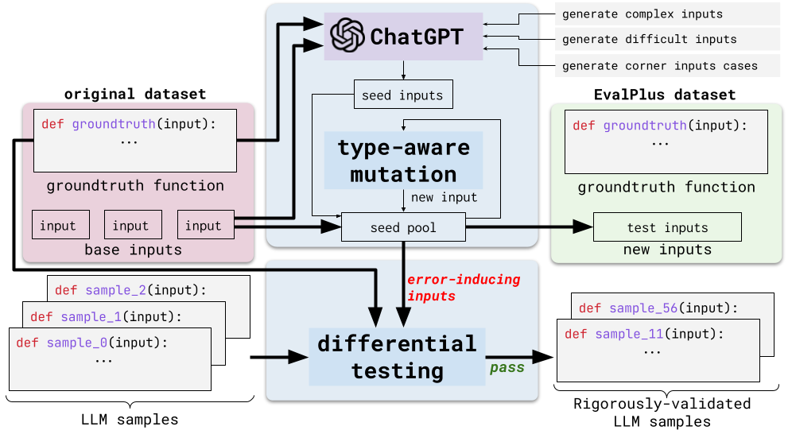
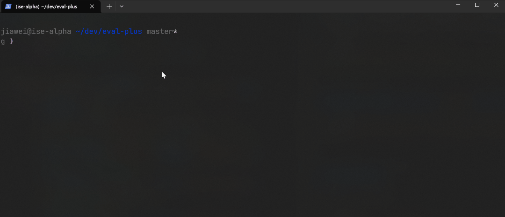

# `EvalPlus(📖) => 📚`

<p align="center">
    <a href="https://pypi.org/project/evalplus/"></a>
    <a href="https://github.com/evalplus/evalplus/blob/master/LICENSE"></a>
    <a href="https://hub.docker.com/r/ganler/evalplus" title="Docker"></a>
</p>


<p align="center">
    <a href="#-Quick-Start">🔥Quick Start</a> •
    <a href="#-LLM-generated-code">💻LLM code</a> •
    <a href="#-Papers">📜Papers</a> •
    <a href="#-Useful-tools">🔨Tools</a> •
    <a href="#-Development">👷Development</a> •
    <a href="#-Acknowledgement">🙏Acknowledgement</a>
</p>

> **Warning**
> <div align="center">
> <b>
> 🚨 Evaluating LLM-generated code over datasets with "3 test-cases" is **NOT** enough! 🚨
> </b>
> </div>

To address this, we started the EvalPlus project -- a rigourous evaluation framework for LLM4Code that:

+ ✨ improves code benchmarks by adding up to thousands of new tests! (81x new tests for HumanEval!)
+ ✨ crafts a set [utility tools](#useful-tools) to sanitize, visualize and inspect LLM-generated code and evaluation results!
+ ✨ accelerates LLM4Code research by open-sourcing [LLM-generated samples](https://github.com/evalplus/evalplus/releases/tag/v0.1.0) for 14+ models -- no need to re-run the expensive benchmarks!



## 🔥 Quick Start

To get started, please first setup the environment:

```bash
pip install evalplus --upgrade
```

...Or you can try out the latest developing version:


```bash
pip install "git+https://github.com/evalplus/evalplus.git" --upgrade
```

<details><summary>🤔 Want to use local GitHub repo? <i>:: click to expand ::</i></summary>
<div>

```bash
git clone https://github.com/evalplus/evalplus.git
cd evalplus
export PYTHONPATH=$PYTHONPATH:$(pwd)
pip install -r requirements.txt
```

</div>
</details>

### HumanEval+

#### Generate Code Samples

The usage is just like the original HumanEval where you just need to implement the `generate_one_completion` function!

```python
from evalplus.data import get_human_eval_plus, write_jsonl

problems = get_human_eval_plus()

num_samples_per_task = 200
samples = [
    dict(task_id=task_id, completion=generate_one_completion(problems[task_id]["prompt"]))
    for task_id in problems
    for _ in range(num_samples_per_task)
]
write_jsonl("samples.jsonl", samples)
```

<details><summary>🤔 What is in a `problem`? <i>:: click to expand ::</i></summary>
<div>

* `task_id` is the identifier string for the task
* `entry_point` is name of the function
* `prompt` is the function signature with docstring
+ `canonical_solution` is the ground-truth implementation (re-implemented to fix bugs in HumanEval)
+ `base_input` is the test inputs in original HumanEval
+ `plus_input` is the test inputs brought by EvalPlus

</div>
</details>

#### Evaluate Code Samples with HumanEval+

You are strongly recommended to use a sandbox such as [docker](https://docs.docker.com/get-docker/):

```bash
docker run -v $(pwd):/app ganler/evalplus:latest --dataset humaneval --samples samples.jsonl
```

...Or if you want to try it locally regardless of the risks ⚠️:

```bash
evalplus.evaluate --dataset humaneval --samples samples.jsonl
```

> **Warning** ⚠️ Do you use a very slow machine?
>
> LLM solutions are regarded as **failed** on timeout (and OOM etc.).
> Specifically, we set the timeout $T=\max(T_{base}, T_{gt}\times k)$, where:
>
> - $T_{base}$ is the minimal timeout (configurable by `--min-time-limit`; default to 0.2s);
> - $T_{gt}$ is the runtime of the ground-truth solutions (achieved via profiling);
> - $k$ is a configurable factor `--gt-time-limit-factor` (default to 4);
>
> If your machine is too slow and you are getting high-variance results, try to use larger $k$ and $T_{base}$.
>
> Additionally, you are **NOT** encouraged to make your test-bed over stressed while running evaluation.
> For example, using `--parallel 64` on a 4-core machine or doing something else during evaluation are bad ideas...

<details><summary>🤔 Evaluate with local GitHub repo? <i>:: click to expand ::</i></summary>
<div>

```bash
export PYTHONPATH=$PYTHONPATH:$(pwd)
python evalplus/evaluate.py --dataset humaneval --samples samples.jsonl
```

</div>
</details>

<details><summary>⌨️ More command-line flags <i>:: click to expand ::</i></summary>
<div>

* `--parallel`: by default half of the cores
* `--base-only` (store_ture): only run base HumanEval tests
* `--i-just-wanna-run`: force a re-run

</div>
</details>

The output should be like (below is GPT-4 greedy decoding example):

```
Computing expected output...
Expected outputs computed in 15.18s
Reading samples...
164it [00:04, 37.79it/s]
Evaluating samples...
100%|██████████████████████████████████████████| 164/164 [00:03<00:00, 44.75it/s]
Base
{'pass@1': 0.8841463414634146}
Base + Extra
{'pass@1': 0.75}
```

- `Base` is the `pass@k` for the original HumanEval
- `Base + Extra` is the `pass@k` for the our **HumanEval+** (with extra tests)
- The "k" includes `[1, 10, 100]` where k values `<=` the sample size will be used
- A cache file named like `samples_eval_results.jsonl` will be cached. Remove it to re-run the evaluation

<details><summary>🤔 How long it would take? <i>:: click to expand ::</i></summary>
<div>

When running 200 samples x 164 tasks x ~700+ tests, it can take around 2-10 minute by using `--parallel 64` and `--test-details`.
Here are some tips to speed up the evaluation:

* Use `--parallel $(nproc)`
* Do **NOT** use `--test-details` if you just want to quickly get pass@k as `--test-details` will run all tests (700+ on average for each task), while without `--test-details` the testing for a sample stops immediately when it fails the first test.
* Use our pre-evaluated results (see [LLM-generated code](#-LLM-generated-code))
* Use HumanEval+ Mini

</div>
</details>

> 🚀 **Try out `HumanEvalPlus-Mini`!** which selects a *minimal* set of additional tests with the highest quality, achieving almost the same effectiveness of the full version. Just add a **`--mini`** flag, it can run 23+% faster! (even faster if you evaluate all tests without fail-stop with `--test-details`).
>
> ```bash
> docker run -v $(pwd):/app ganler/evalplus:latest --dataset humaneval --samples samples.jsonl --mini
> # ...Or locally ⚠️
> # evalplus.evaluate --dataset humaneval --samples samples.jsonl --mini
> ```

### MBPP+ (TBD)


## 💻 LLM-generated code

Please kindly find the LLM-pre-generated code samples [in the attachment of our v0.1.0 release](https://github.com/evalplus/evalplus/releases/tag/v0.1.0).
Each sample file is packaged in a zip file named like `${model_name}_temp_${temperature}.zip`.
You can unzip them to a folder named like `${model_name}_temp_${temperature}` and run the evaluation from scratch with:

```bash
evalplus.evaluate --dataset humaneval --samples ${model_name}_temp_${temperature}
```

## 📜 Papers

Read our [**paper**](https://arxiv.org/abs/2305.01210) for more detailed findings!

```bibtex
@article{evalplus,
  title={Is Your Code Generated by ChatGPT Really Correct? Rigorous Evaluation of Large Language Models for Code Generation},
  author={Jiawei Liu and Chunqiu Steven Xia and Yuyao Wang and Lingming Zhang},
  journal={arXiv preprint arXiv:2305.01210},
  year={2023},
}
```

## 🔨 Useful tools

To use these tools, please first install the repository from GitHub:

```bash
git clone https://github.com/evalplus/evalplus.git
cd evalplus
pip install -r requirements-tools.txt
```

### Syntax checker for LLM-generated code

Check LLM-produced code and answer the following questions:

1. Is the generation entirely done for all samples / all problems in the dataset?
2. Are LLM-generated code compilable? (if no, something could be wrong and you'd better check)

```shell
python tools/checker.py --folder /path/to/[model]-[??]b_temp_[??] --dataset humaneval
```

### Post code sanitizer

LLM-generated code may contain some syntax errors.
But some of them can be easily fixable by doing simple post-processing.
This tool will make the LLM-generated code more clean/compilable by doing certain post-processing such as trimming with more magical EOFs and some garbage non-code tokens.

```shell
python tools/sanitize.py --eof --folder /path/to/vicuna-[??]b_temp_[??]
# Sanitized code will be produced to `/path/to/vicuna-[??]b_temp_[??]-sanitized`
```

### Render `pass@k` results to `rich` and LaTeX tables

```shell
python tools/render.py --type /path/to/[model]-[??]b # NOTE: no `_temp_[??]`
```



### Perform test input generation from scratch (TBD)


## 👷 Development

Before you start:

```bash
pip install pre-commit
pre-commit install
export PYTHONPATH=$PYTHONPATH:$(pwd)
```

### Name convention

- `evalplus` is the package name.
- `${DATASET}_plus` is the name of dataset applied with `evalplus`.


## 🙏 Acknowledgement

- [HumanEval](https://github.com/openai/human-eval)
